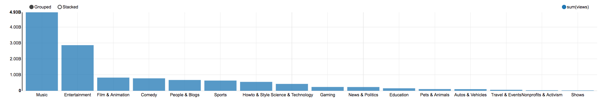
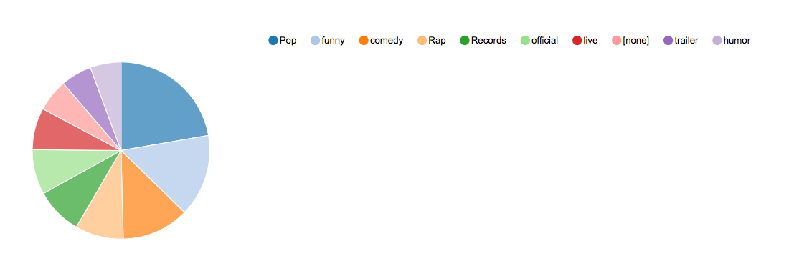
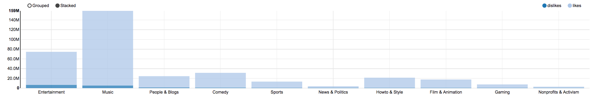

# Spark for data scientists
## Datascience notebooks
[Zeppelin notebook documentation](https://zeppelin.apache.org/docs/0.7.3/).

Run [run_zeppelin.sh](run_zeppelin.sh) script:
```
./run_zeppelin.sh
```

## Assignment
Open **Youtube Videos** notebook.
1. Find top 10 trending videos (by views)
2. Find top most viewed categories

3. Find top 10 most viewed tags

3. Find top 10 most controversial categories (most disliked) and show how many likes and dislikes they have



## Traps
Be careful, the notebook we are using is using Spark version 2.1, which doesn't support multiline json. Check out your [spark-sql](../spark-sql) code and see if you can store categories in a single json object per line format. This can be then easilly loaded in the notebook using:

```scala
val categories = spark.read.json("/data/categories_single_line.json")
```