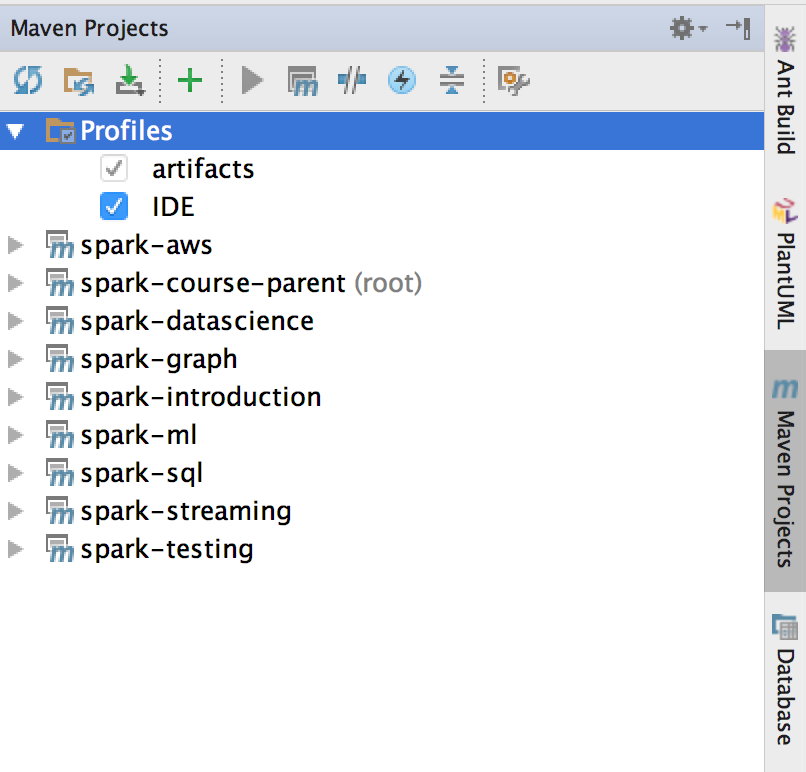

# Spark Introduction
Walk through the [Spark introduction presentation](SparkIntroduction.pptx).

## Assignemnet 1: Log Analysis
 Complete the code in [LogAnalysis.java](src/main/java/com/ivolasek/sparkcourse/wordcount/LogAnalysis.java) so that
 the program walks through the log file stored in [data/sample.log](data/sample.log) and computes number of times each
 severity (INFO, WARNING, ERROR, DEBUG) appears in the log.

 ### Sample file
 ```
 WARNING This is WARNING message
 DEBUG This is DEBUG message
 DEBUG This is DEBUG message
 INFO This is INFO message
 WARNING This is WARNING message
 ERROR This is ERROR message
 ```

### Sample output
```
[(WARNING,2), (ERROR,1), (DEBUG,2), (INFO,1)]
```

### Useful functions in Java
* [<K2,V2> JavaPairRDD<K2,V2> mapToPair(PairFunction<T,K2,V2> f)](https://spark.apache.org/docs/2.0.2/api/java/org/apache/spark/api/java/JavaRDDLike.html#mapToPair(org.apache.spark.api.java.function.PairFunction)
* [JavaPairRDD<K,V> reduceByKey(Function2<V,V,V> func)](https://spark.apache.org/docs/2.0.1/api/java/org/apache/spark/api/java/JavaPairRDD.html#reduceByKey(org.apache.spark.api.java.function.Function2))

### Warning
Don't forget to switch on the IDE maven profile in your IDE (at least if you are using IntelliJ Idea) for your dependencies to work.



The root [pom.xml](../pom.xlm) contains following profile configuration:

```xml
    <properties>
        <!-- .... -->
        <hadoop.scope>provided</hadoop.scope>
    </properties>

    <profiles>
        <profile>
            <id>IDE</id>
            <properties>
                <hadoop.scope>compile</hadoop.scope>
            </properties>
        </profile>
    </profiles>
```

