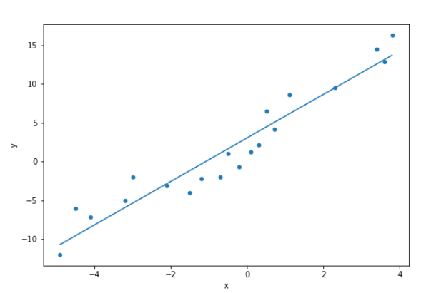
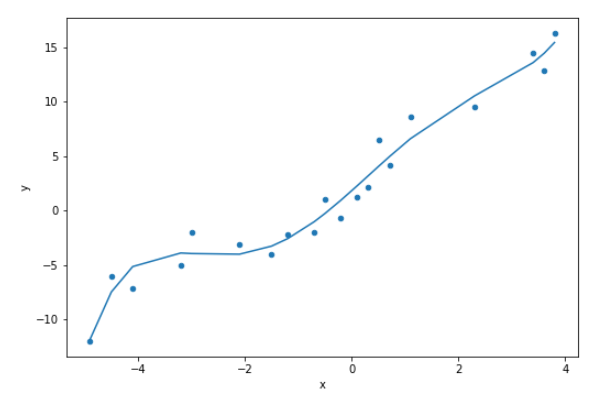

# Spark ML
## Introduction
You can walk through [Spark ML introduction](https://www.edureka.co/blog/spark-mllib/).

[The official Spark ML documentation](https://spark.apache.org/docs/latest/ml-guide.html) is also useful (focus on MLlib: Main Guide).

## Useful classes
* [VectorAssembler](https://spark.apache.org/docs/latest/ml-features.html#vectorassembler)
* [LinearRegression](https://spark.apache.org/docs/latest/ml-classification-regression.html#linear-regression)
* [Pipelines](https://spark.apache.org/docs/latest/ml-pipeline.html)

## Assignment
Prepare a linear regression model to estimate function represented by sample input data.

1. Create a [VectorAssembler](https://spark.apache.org/docs/latest/ml-features.html#vectorassembler) that preprocesses input data into a single valued feature vector containing x values from the source dataset.
2. Construct a [LinearRegression](https://spark.apache.org/docs/latest/ml-classification-regression.html#linear-regression) model with y values as the label (estimated column).
3. Create a [Pipeline](https://spark.apache.org/docs/latest/ml-pipeline.html) that uses the VectorAssmbler for preprocessing and LinearRegression as a model and fit this pipeline with source data.
4. Check statistics of the fitted model:
    ```
    RMSE:  2.1064773603437077
    r2:    0.9205193637224095
    Model: Y = 2.8057645950707633 * X + 3.045896709023059
    ```
5. Use the model to predic values on the same source dataset.
    ```
    +-----+----+--------+--------------------+
    |    y|   x|features|          prediction|
    +-----+----+--------+--------------------+
    |-12.0|-4.9|  [-4.9]| -10.702349806823683|
    | -6.0|-4.5|  [-4.5]|  -9.580043968795376|
    | -7.2|-4.1|  [-4.1]|   -8.45773813076707|
    | -5.0|-3.2|  [-3.2]| -5.9325499952033836|
    | -2.0|-3.0|  [-3.0]|  -5.371397076189232|
    | -3.1|-2.1|  [-2.1]| -2.8462089406255444|
    | -4.0|-1.5|  [-1.5]| -1.1627501835830865|
    | -2.2|-1.2|  [-1.2]|-0.32102080506185704|
    ...
    ```
6. Plot source data together with the prediction.


### Bonus
You can try to prepare a polynomial regression that fits the data better.

**Hint:** [Polynomial regression is a kind of linear regression](https://math.stackexchange.com/questions/75959/why-is-polynomial-regression-considered-a-kind-of-linear-regression)

