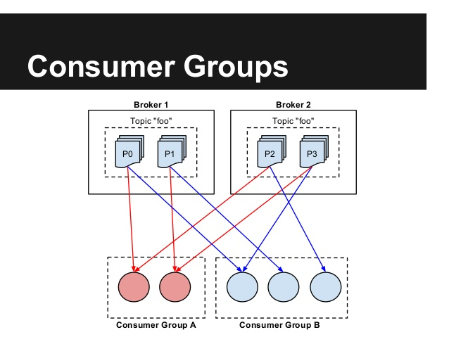

# Spark Streaming

## Spark Structured Streaming and Kafka
Walk through the documentation:
* [Spark Structured Streaming](https://spark.apache.org/docs/latest/structured-streaming-programming-guide.html#creating-streaming-dataframes-and-streaming-datasets)
* [Spark Kafka Integration](https://spark.apache.org/docs/2.2.0/structured-streaming-kafka-integration.html)

## Writing a stream
### Writing to a console
```java
    StreamingQuery query = dataset.writeStream()
            .format("console")
            .start();

    query.awaitTermination();
```

### Output mode
```
StreamingQuery query = dataset.writeStream()
            .outputMode("update")
            .format("console")
            .start();
```

* **Append mode (default)** - This is the default mode, where only the new rows added to the Result Table since the last trigger will be outputted to the sink. This is supported for only those queries where rows added to the Result Table is never going to change. Hence, this mode guarantees that each row will be output only once (assuming fault-tolerant sink). For example, queries with only select, where, map, flatMap, filter, join, etc. will support Append mode.
* **Complete mode** - The whole Result Table will be outputted to the sink after every trigger. This is supported for aggregation queries.
* **Update mode** - (Available since Spark 2.1.1) Only the rows in the Result Table that were updated since the last trigger will be outputted to the sink. More information to be added in future releases.

### Watermarking


## Kafka
In the assignment we will be using the [Spotify Kafka Docker image](https://hub.docker.com/r/spotify/kafka/).

You can walk through the basic [Kafka Introduction](https://kafka.apache.org/intro).

## Consumer groups



# Assignment

1. Start Kafka:
```bash
./run_kafka.sh
```
2. Start a mock web server on port 9999
```bash
./start_socket.sh
```
3. Write a Spark Streaming application that will consume data from the started endpoint (using a standard Spark socket input) and emit a Kafka message for each line published by the web server.
4. Create a second Spark Streaming application that will consume data from Kafka published by the first application and compute a sentiment score for each tweet.
    * You can use a static dataset in [data/sentiment.tsv](data/sentiment.tsv) that contains scores sentiment scores for individual english words.
    * The sentiment score of a tweet is computed as a sum of all sentiment scores of words in the tweet.
    ```
    Tweet: I like this great song!
    Sentiment scores:
                        like  ... 2
                        great ... 3
    sentiment_score_of_the_tweet = 2 + 3 = 5
    ```
    * The output of the sentiment analysis should be printed to the console.

**Hint:** For debugging purposes it might be useful to download Kafka from https://kafka.apache.org/downloads and use the console producer and consumer.

## Warning
Before you relaunch [SocketStreaming](src/main/java/com/ivolasek/sparkcourse/streaming/SocketStreaming.java) class, make sure to delete [streaming-checkpoint](streaming-checkpoint) directory. This is because the socket source [does not maintain an offset](https://stackoverflow.com/questions/50493552/offsets-committed-out-of-order-with-spark-datasource-api-v2-hive-streaming-sink).  